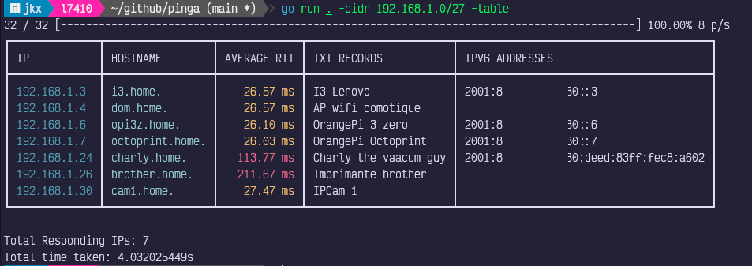

# Pinga

Pinga is a fast network scanner written in Go. It uses parallel ping
commands to quickly discover live hosts in a given network range (CIDR).
Results can be displayed as a colorized table or a simple list, including
hostname, average RTT, TXT records, and IPv6 addresses.



## Features
- Fast parallel pinging of IPs in a CIDR range
- Colorized output for RTT (green/yellow/red)
- Table or list display modes
- Shows hostname, TXT records, and IPv6 addresses
- Customizable parallelism

## Installation

Make sure you have Go installed (version 1.18+ recommended).

Install from source:

```sh
git clone https://github.com/jkerdreux-imt/pinga.git
cd pinga
go mod tidy
go build
```
This will produce a `pinga` binary in the current directory.

Install from GitHub directly:
```sh
go install github.com/jkerdreux-imt/pinga@latest
```


## Usage

Scan a network and display results as a table:

```sh
./pinga -cidr 192.168.1.0/24 -table
```

Scan with custom parallelism and list output:

```sh
./pinga -cidr 10.0.0.0/16 -parallel 500
```

### Command-line Options
```
Usage of pinga:
  -cidr string
        CIDR notation of the network (e.g., 192.168.1.0/24)
  -parallel int
        Maximum number of parallel pings (default 255)
  -table
        Display results in a table (ASCII art)
```

## Dependencies
- [cheggaaa/pb](https://github.com/cheggaaa/pb) (progress bar)
- [fatih/color](https://github.com/fatih/color) (color output)
- [go-pretty/table](https://github.com/jedib0t/go-pretty) (table rendering)

These are managed automatically via Go modules.

## Troubleshooting
- Make sure you run as root or with sufficient privileges to send ICMP
  packets.
- On some systems, the `ping` command may require special permissions.
- If you see errors about missing dependencies, run `go mod tidy`.

## License

This project is licensed under the GNU General Public License v3.0 (GPLv3).
See the [LICENSE](./LICENSE) file for details.

---

Feel free to open issues or contribute!
